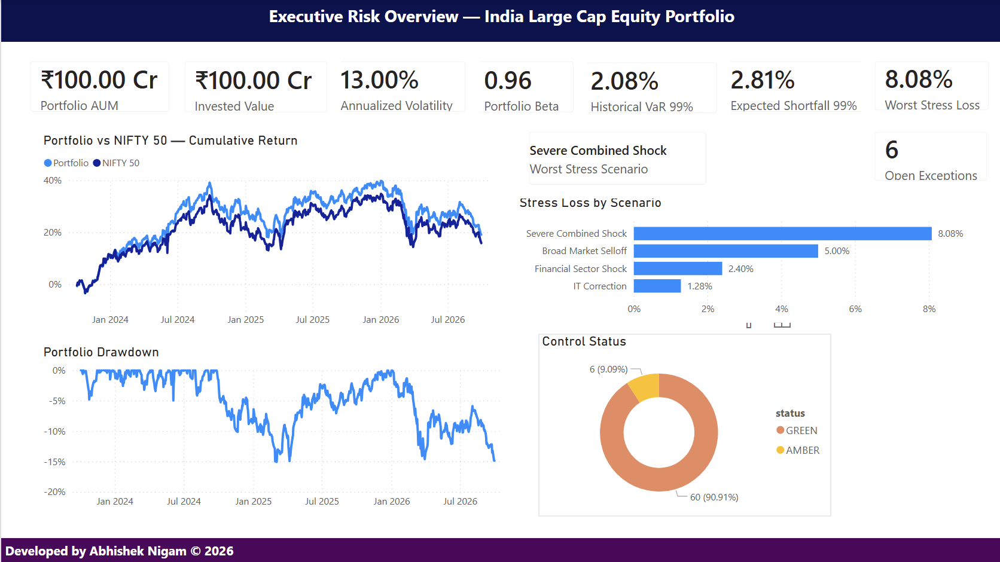
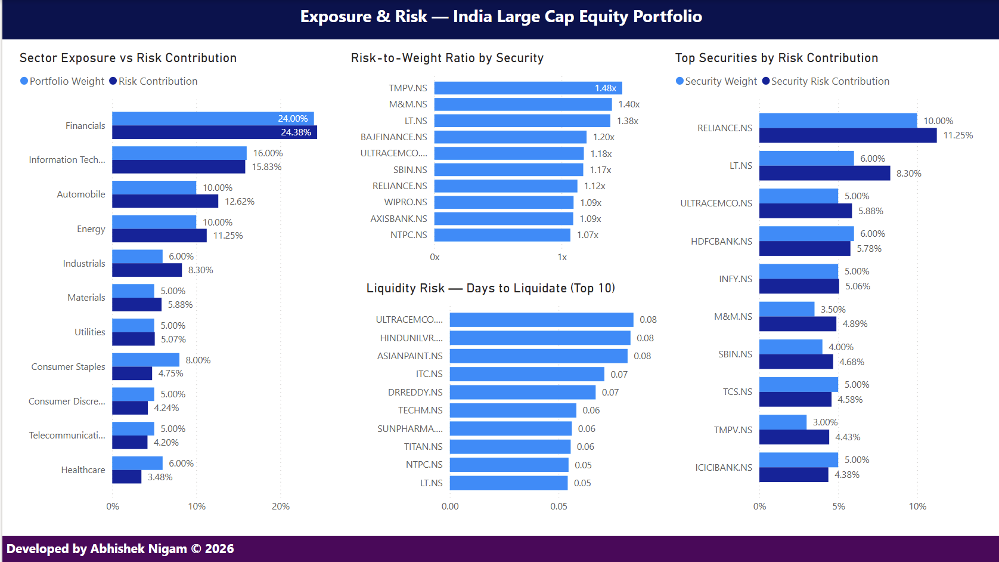
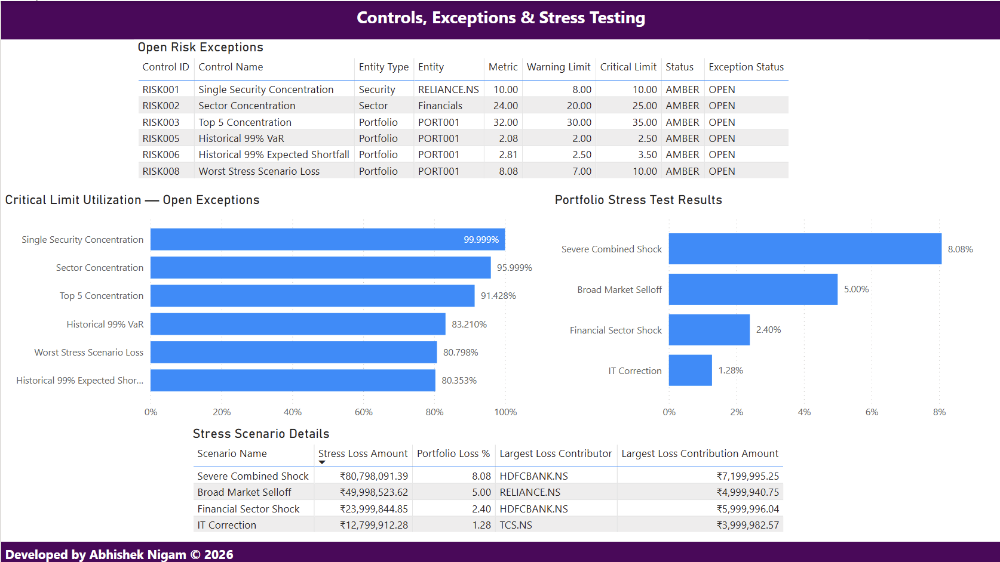

# Institutional Portfolio Risk & Controls Platform

A full-stack portfolio risk analytics, controls, and business intelligence platform built for a simulated ₹100 crore Indian large-cap equity portfolio.

The project combines **Python analytics, PostgreSQL data modeling, automated risk controls, stress testing, liquidity analysis, benchmark analytics, and Power BI reporting** into a single end-to-end workflow.

> **Valuation Date:** 30 September 2026  
> **Portfolio:** India Large Cap Equity Portfolio  
> **Target AUM:** ₹100 Crore  
> **Benchmark:** NIFTY 50

---

## Overview

Investment and risk teams require more than standalone calculations such as Value-at-Risk or volatility.

A practical risk platform must be able to:

- construct and validate portfolio positions,
- measure exposures and concentration,
- calculate market risk,
- estimate liquidity,
- run stress scenarios,
- identify risk concentrations,
- compare the portfolio with a benchmark,
- evaluate risk limits,
- generate exceptions,
- persist results in a structured database,
- and present the outputs through management dashboards.

This project implements that workflow from raw market data through executive reporting.

---

## Business Problem

Portfolio risk information is often fragmented across spreadsheets, scripts, reports, and dashboards.

That creates several challenges:

- inconsistent risk calculations,
- limited auditability,
- manual monitoring of limits,
- difficulty reconciling metrics across systems,
- limited drill-down from portfolio to sector and security level,
- and management reporting that is disconnected from the analytical engine.

The objective of this project was to build a centralized analytical platform capable of answering questions such as:

**Portfolio Risk**
- What is the portfolio's volatility?
- What is the 99% Value-at-Risk?
- How large are expected losses beyond VaR?
- What was the worst historical drawdown?

**Exposure & Concentration**
- Which securities have the largest portfolio weights?
- Which sectors represent concentration risk?
- Which securities contribute disproportionately to portfolio risk?

**Liquidity**
- How many trading days would be required to liquidate each position?
- Which positions are least liquid?

**Stress Testing**
- What happens under broad market, financial-sector, and technology shocks?
- Which security contributes the largest loss under each scenario?

**Controls**
- Which portfolio risk limits are within tolerance?
- Which controls are approaching critical thresholds?
- Which exceptions require monitoring?

**Benchmarking**
- How does the portfolio behave relative to the NIFTY 50?
- What are beta, correlation, tracking error, and information ratio?

---

# Solution Architecture

```text
                    MARKET / REFERENCE DATA
                             │
                             ▼
                   ┌───────────────────┐
                   │      Python       │
                   │                   │
                   │ • Data ingestion  │
                   │ • Validation      │
                   │ • Portfolio build │
                   │ • Risk analytics  │
                   │ • Stress testing  │
                   │ • Controls        │
                   └─────────┬─────────┘
                             │
                             ▼
                     PROCESSED DATA
                             │
                             ▼
                   ┌───────────────────┐
                   │    PostgreSQL     │
                   │                   │
                   │ • Dimensions      │
                   │ • Fact tables     │
                   │ • Constraints     │
                   │ • Reconciliation  │
                   │ • Analytical views│
                   └─────────┬─────────┘
                             │
                             ▼
                   ┌───────────────────┐
                   │     Power BI      │
                   │                   │
                   │ Executive Risk    │
                   │ Exposure & Risk   │
                   │ Controls & Stress │
                   └───────────────────┘
```

The design intentionally separates:

**Analytics → Persistence → Reporting**

rather than performing all calculations directly inside the BI layer.

---

# Technology Stack

| Layer | Technology |
|---|---|
| Programming | Python 3.10 |
| Data Analysis | Pandas, NumPy |
| Market Data | yfinance |
| Database | PostgreSQL 18 |
| Query Language | SQL |
| Business Intelligence | Power BI Desktop |
| Version Control | Git / GitHub |
| Development | VS Code |
| Operating Environment | macOS + Windows via Parallels for Power BI |

---

# Portfolio Snapshot

The simulated portfolio contains **25 Indian large-cap equities** across **11 sectors**.

| Metric | Result |
|---|---:|
| Target AUM | ₹1,000,000,000 |
| Invested Value | ₹999,970,472.33 |
| Equity Allocation | 99.9970% |
| Residual Cash | ~0.0030% |
| Number of Securities | 25 |
| Number of Sectors | 11 |
| Largest Security | Reliance Industries |
| Largest Security Weight | ~10.00% |
| Largest Sector | Financials |
| Financials Exposure | ~24.00% |
| Top-5 Concentration | ~32.00% |

Positions are generated using whole-share quantities based on the latest common completed market date across all securities.

---

# Risk Analytics

The platform calculates both portfolio-level and security-level risk metrics.

## Portfolio Risk

| Metric | Result |
|---|---:|
| Historical Return Observations | 743 |
| Average Daily Return | 0.0269% |
| Daily Volatility | 0.8192% |
| Annualized Volatility | 13.0045% |
| Simulated Cumulative Return | 19.1122% |
| Maximum Drawdown | -15.0850% |
| Maximum Drawdown Date | 04 March 2025 |
| Best Daily Return | 3.5615% |
| Worst Daily Return | -4.9810% |

The historical portfolio series applies the **current portfolio weights** to historical security returns.

It therefore represents a **current-weight hypothetical historical simulation**, not realized historical portfolio performance.

---

# Value-at-Risk & Expected Shortfall

Historical simulation is used as the primary VaR methodology for the control framework.

| Confidence | Historical VaR | VaR Amount | Expected Shortfall | ES Amount |
|---|---:|---:|---:|---:|
| 95% | 1.3583% | ₹13.58M | 1.8222% | ₹18.22M |
| 99% | 2.0802% | ₹20.80M | 2.8124% | ₹28.12M |

The platform also calculates parametric VaR for model comparison.

| Confidence | Historical VaR | Parametric VaR |
|---|---:|---:|
| 95% | 1.3583% | 1.3206% |
| 99% | 2.0802% | 1.8789% |

At the 99% confidence level, historical VaR is approximately **10.7% higher than parametric VaR**, indicating that the historical downside distribution produces larger tail-loss estimates than the normal-distribution assumption.

---

# Risk Contribution

Portfolio volatility is decomposed using covariance-based component risk contribution.

Security-level risk contributions reconcile to:

```text
100.000000%
```

Sector-level risk contributions also reconcile to:

```text
100.000000%
```

Selected security results:

| Security | Portfolio Weight | Risk Contribution | Risk / Weight |
|---|---:|---:|---:|
| RELIANCE.NS | 10.00% | 11.25% | 1.12x |
| LT.NS | 6.00% | 8.30% | 1.38x |
| ULTRACEMCO.NS | 5.00% | 5.88% | 1.18x |
| HDFCBANK.NS | 6.00% | 5.78% | 0.96x |
| INFY.NS | 5.00% | 5.06% | 1.01x |
| M&M.NS | 3.50% | 4.89% | 1.40x |
| TMPV.NS | 3.00% | 4.43% | 1.48x |

A risk-to-weight ratio greater than **1.0x** indicates that the security contributes more portfolio risk than its allocation weight.

---

# Sector Risk

The portfolio contains 11 sectors.

Selected sector results:

| Sector | Portfolio Weight | Risk Contribution |
|---|---:|---:|
| Financials | 24.00% | 24.38% |
| Information Technology | 16.00% | 15.83% |
| Automobile | 10.00% | 12.62% |
| Energy | 10.00% | 11.25% |
| Industrials | 6.00% | 8.30% |
| Materials | 5.00% | 5.88% |
| Utilities | 5.00% | 5.07% |
| Consumer Staples | 8.00% | 4.75% |
| Healthcare | 6.00% | 3.48% |

Automobile and Industrials contribute proportionally more risk than their portfolio weights, while sectors such as Consumer Staples and Healthcare contribute relatively less.

---

# Liquidity Risk

Liquidity risk is estimated using:

```text
20-day Average Daily Volume
Maximum Participation Rate = 20%
```

For each security:

```text
Daily Liquidation Capacity
    = ADV × Participation Rate

Days to Liquidate
    = Position Quantity / Daily Liquidation Capacity
```

All 25 securities fall within the platform's **HIGH liquidity classification**.

The least-liquid positions still require significantly less than one trading day under the configured assumptions.

Maximum estimated liquidation time:

```text
~0.084 trading days
```

for `ULTRACEMCO.NS`.

---

# Stress Testing

Four hypothetical management stress scenarios are implemented.

| Rank | Scenario | Portfolio Loss |
|---:|---|---:|
| 1 | Severe Combined Shock | 8.0798% |
| 2 | Broad Market Selloff | 4.9999% |
| 3 | Financial Sector Shock | 2.4000% |
| 4 | IT Correction | 1.2800% |

### Severe Combined Shock

The most severe configured scenario results in:

```text
Stress Loss:
₹80,798,091.39

Portfolio Loss:
8.0798%

Largest Loss Contributor:
HDFCBANK.NS
```

Stress scenarios are hypothetical analytical assumptions and should not be interpreted as forecasts.

---

# Benchmark Analysis

The portfolio is compared against the **NIFTY 50**.

| Metric | Result |
|---|---:|
| Aligned Observations | 738 |
| Beta | 0.9588 |
| Correlation | 0.9764 |
| R² | 0.9533 |
| Portfolio Annualized Volatility | 13.0485% |
| NIFTY 50 Annualized Volatility | 13.2874% |
| Tracking Error | 2.8732% |
| Annualized Active Return | 0.9214% |
| Information Ratio | 0.3207 |
| Portfolio Simulated Cumulative Return | 19.1122% |
| NIFTY 50 Cumulative Return | 15.8315% |

The portfolio exhibits high benchmark correlation while maintaining slightly lower volatility and positive simulated active return over the analyzed period.

---

# Risk Controls & Exceptions

The platform contains **8 configurable risk controls**.

| Control | Warning | Critical |
|---|---:|---:|
| Single Security Concentration | 8% | 10% |
| Sector Concentration | 20% | 25% |
| Top-5 Concentration | 30% | 35% |
| Cash Exposure | 5% | 10% |
| Historical 99% VaR | 2.0% | 2.5% |
| Historical 99% Expected Shortfall | 2.5% | 3.5% |
| Days to Liquidate | 1 day | 3 days |
| Worst Stress Scenario Loss | 7% | 10% |

The automated control engine evaluates **66 control tests**.

Final status:

```text
GREEN : 60
AMBER : 6
RED   : 0
```

Six open exceptions are generated:

| Control | Entity | Result |
|---|---|---:|
| Single Security Concentration | RELIANCE.NS | ~10.00% |
| Sector Concentration | Financials | ~24.00% |
| Top-5 Concentration | PORT001 | ~32.00% |
| Historical 99% VaR | PORT001 | 2.0802% |
| Historical 99% Expected Shortfall | PORT001 | 2.8124% |
| Worst Stress Scenario Loss | PORT001 | 8.0798% |

The controls framework distinguishes between:

```text
GREEN  → within warning threshold
AMBER  → warning threshold breached
RED    → critical threshold breached
```

Risk thresholds in this project are management-configured hypothetical assumptions for demonstration purposes.

---

# Power BI Dashboard

The reporting layer contains three management-focused pages.

## 1. Executive Risk Overview



Provides executive-level monitoring of:

- Portfolio AUM
- Invested value
- Annualized volatility
- Beta
- Historical 99% VaR
- Expected Shortfall
- Worst stress loss
- Open exceptions
- Portfolio vs NIFTY 50 cumulative returns
- Drawdown
- Stress scenarios
- Control status

---

## 2. Exposure & Risk



Provides portfolio drill-down into:

- sector exposure,
- sector risk contribution,
- security risk contribution,
- security risk-to-weight ratios,
- liquidity,
- and days to liquidate.

---

## 3. Controls, Exceptions & Stress Testing



Provides monitoring of:

- open risk exceptions,
- warning and critical thresholds,
- critical-limit utilization,
- stress scenario losses,
- and largest loss contributors.

---

# PostgreSQL Data Model

The analytical database is implemented under:

```text
risk_platform
```

Key dimensions include:

```text
dim_security
dim_portfolio
dim_risk_limit
```

Core fact tables include:

```text
fact_position
fact_control_result
fact_control_exception
fact_liquidity
fact_security_risk_contribution
fact_sector_risk_contribution
fact_stress_result
fact_portfolio_risk_summary
fact_var_result
fact_benchmark_risk_summary
fact_portfolio_daily_return
fact_benchmark_daily_return
```

Power BI consumes six analytical SQL views:

```text
vw_executive_risk_overview
vw_security_risk_profile
vw_sector_risk_profile
vw_controls_exceptions
vw_stress_scenarios
vw_portfolio_benchmark_timeseries
```

Database constraints are used for data-quality controls including:

- primary and foreign keys,
- uniqueness,
- valid thresholds,
- portfolio-value reconciliation,
- P&L reconciliation,
- risk contribution reconciliation,
- active-return reconciliation,
- and status consistency.

---

# Data Quality & Validation

Validation is performed at multiple layers.

### Python validation

Checks include:

- duplicate securities,
- missing reference data,
- portfolio weights,
- market-data completeness,
- duplicate dates,
- missing prices,
- OHLC consistency,
- negative volume,
- position reconciliation,
- risk contribution totals,
- benchmark alignment,
- and valuation-date filtering.

### PostgreSQL validation

The final database QA script validates:

```text
15 / 15 core datasets → PASS
```

including:

```text
25 securities
1 portfolio
8 risk controls
25 positions
66 control results
6 exceptions
25 liquidity records
25 security risk contribution records
11 sector risk contribution records
4 stress scenarios
743 portfolio daily returns
738 benchmark-aligned returns
```

Final risk contribution reconciliation:

```text
Security Risk Contribution = 100.000000%
Sector Risk Contribution   = 100.000000%
```

Final QA script:

```text
sql/34_final_qa.sql
```

---

# Methodology

## Market Data

Three years of daily historical NSE market data are downloaded using `yfinance`.

All historical analytics are explicitly filtered to:

```text
Date <= Portfolio Valuation Date
```

to avoid look-ahead bias.

---

## Portfolio Construction

Target allocations are converted into whole-share quantities using market prices on the latest common completed trading date.

Residual capital is retained as cash.

---

## Returns

Security returns are calculated from adjusted historical closing prices.

Current portfolio weights are then applied to the historical security return matrix.

This produces a hypothetical historical return series for the **current portfolio composition**.

---

## Volatility

Daily portfolio volatility is annualized using:

```text
Annualized Volatility
    = Daily Standard Deviation × √252
```

---

## Historical VaR

Historical VaR is estimated from the empirical loss distribution.

The 99% VaR represents the historical loss threshold exceeded by approximately 1% of observations under the historical simulation.

---

## Expected Shortfall

Expected Shortfall measures the average loss beyond the VaR threshold.

It is therefore used to capture tail severity beyond VaR.

---

## Risk Contribution

Risk contribution is based on the covariance structure of portfolio returns.

Component risk contributions reconcile to total portfolio volatility and are normalized to 100%.

---

## Liquidity

Liquidity estimates are based on a 20-day average daily trading volume and a maximum participation rate of 20%.

---

## Stress Testing

Stress scenarios apply configured portfolio-level and sector-level shocks.

For combined scenarios, sector-specific shocks override the general portfolio shock for the relevant positions rather than being added to it.

---

# Key Findings

The platform identifies several notable risk characteristics:

- **Financials** represent the largest sector exposure at approximately **24%**, triggering an AMBER concentration exception.
- **Reliance Industries** represents approximately **10%** of portfolio exposure and triggers the single-security warning control.
- The portfolio's **Top-5 concentration is approximately 32%**, exceeding the warning threshold.
- Historical **99% VaR is 2.08%**, above the configured 2.0% warning threshold.
- Historical **99% Expected Shortfall is 2.81%**, above its 2.5% warning threshold.
- The Severe Combined Shock produces an **8.08% portfolio loss**, triggering the stress warning control.
- No configured control breaches its critical threshold.
- All modeled positions remain highly liquid under the configured 20% ADV participation assumption.
- The portfolio maintains a **0.9588 beta** and **0.9764 correlation** with NIFTY 50.
- Risk contribution analysis highlights securities such as `TMPV.NS`, `M&M.NS`, and `LT.NS` as contributing proportionally more risk than their portfolio weights.

---

# Project Structure

```text
portfolio-risk-controls/
│
├── data/
│   ├── raw/
│   │   ├── market_prices/
│   │   └── benchmark/
│   │
│   ├── processed/
│   └── reference/
│
├── src/
│   ├── ingestion/
│   ├── validation/
│   ├── portfolio/
│   ├── risk/
│   └── controls/
│
├── sql/
│   ├── 01_create_core_schema.sql
│   ├── ...
│   └── 34_final_qa.sql
│
├── dashboards/
│   ├── Institutional_Portfolio_Risk_Controls.pbix
│   │
│   └── screenshots/
│       ├── 01_executive_risk_overview.png
│       ├── 02_exposure_and_risk.png
│       └── 03_controls_and_stress.png
│
├── notebooks/
├── docs/
├── tests/
├── config/
│
├── requirements.txt
├── .gitignore
└── README.md
```

---

# How to Run

## 1. Clone the repository

```bash
git clone <repository-url>
cd portfolio-risk-controls
```

## 2. Create a Python environment

```bash
python3 -m venv .venv
source .venv/bin/activate
```

## 3. Install dependencies

```bash
pip install -r requirements.txt
```

## 4. Start PostgreSQL

Example using Homebrew:

```bash
brew services start postgresql@18
```

Create the project database:

```bash
createdb portfolio_risk_db
```

## 5. Run the analytical pipeline

The Python modules under:

```text
src/ingestion/
src/portfolio/
src/risk/
src/controls/
```

generate and validate the processed analytical datasets.

The project intentionally separates data generation from database loading.

## 6. Build the PostgreSQL layer

Run the SQL scripts from the project root in numeric order.

Example:

```bash
psql -d portfolio_risk_db -f sql/01_create_core_schema.sql
```

Continue through the create/load/view scripts.

Final QA:

```bash
psql -d portfolio_risk_db -P pager=off -f sql/34_final_qa.sql
```

## 7. Open Power BI

Open:

```text
dashboards/Institutional_Portfolio_Risk_Controls.pbix
```

The dashboard consumes the PostgreSQL analytical views.

---

# Assumptions & Limitations

This is a portfolio analytics demonstration project and not a production trading or regulatory risk system.

Important limitations include:

- The portfolio is synthetic.
- Current portfolio weights are applied to historical returns.
- Historical simulated performance is therefore not actual realized fund performance.
- Risk limits are hypothetical management-configured thresholds.
- Stress scenarios are analytical assumptions rather than forecasts.
- Liquidity estimates assume a constant 20% ADV participation rate.
- Historical liquidity may differ during stressed market conditions.
- Market data is sourced through Yahoo Finance via `yfinance`.
- Vendor data may contain backfilled or adjusted history around corporate actions and ticker changes.
- Transaction costs, taxes, market impact, slippage, and bid-ask spreads are not modeled.
- VaR and Expected Shortfall estimates are based on historical observations and remain sensitive to the selected lookback window.
- Benchmark-relative analytics are based on aligned available trading dates.
- The project is designed for analytical demonstration, portfolio engineering, and business intelligence purposes.

---

# Future Enhancements

Potential extensions include:

- rolling VaR and volatility,
- factor-risk decomposition,
- scenario libraries based on historical crises,
- Monte Carlo VaR,
- expected shortfall backtesting,
- automated daily orchestration,
- PostgreSQL stored procedures,
- portfolio-level date history,
- multiple portfolios,
- user-configurable risk limits,
- limit-direction support for lower-bound controls,
- automated email/Slack exception alerts,
- Power BI scheduled refresh,
- Azure/AWS deployment,
- CI/CD validation,
- Docker containerization,
- API-based portfolio ingestion,
- transaction-level holdings,
- and production-grade authentication and access controls.

---

# Final QA Status

```text
Core datasets validated:        15 / 15 PASS
Control tests:                  66
GREEN controls:                 60
AMBER controls:                  6
RED controls:                    0
Open exceptions:                 6

Security risk contribution:    100.000000%
Sector risk contribution:      100.000000%

Power BI analytical views:       6 / 6 present
```

---

# Author

**Abhishek Nigam**

MS in Business Analytics from UC San Diego

Portfolio focus:
- Risk Analytics
- Data Analytics
- Business Intelligence
- Financial Services Analytics
- SQL / Python / Power BI

---

## Disclaimer

This project is intended for educational, analytical, and portfolio-demonstration purposes only.

It does not constitute investment advice, financial advice, a trading recommendation, or a production regulatory risk model.